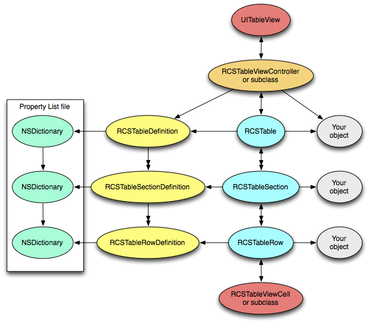

RCSTableKit
============

UITableView is a (the?) staple of iOS interfaces. Despite its ubiquity, to use one you must implement dozens of delegate and data source methods in your view controllers to use a UITableView fully. Most of the code is pure boilerplate! Boilerplate code sucks.

RCSTableKit provides a higher level interface for designing awesome UITableView-based interfaces. A simple .plist-based file declaratively constructs your table views, and makes it easy to bind your interface to your objects.

Why should I use this?
----------------------

- You become more productive creating and maintaining UITableView-based interfaces.
- You can remove the complicated, error-prone boilerplate that manages your table layouts.

Requirements
------------
- iOS 4.x

Building RCSTableKit
-------------------
- Clone RCSTableKit from GitHub: `git clone git://github.com/JimRoepcke/RCSTableKit.git`
- Open RCSTableKit/src/RCSTableKit.xcodeproj in Xcode
- Build

Using RCSTableKit in your iOS app project (using Xcode 4.2.x)
-------------------------------------------------------------
- TODO: rewrite this for Xcode 4, these instructions are for 3.2.x.
- Open RCSTableKit/src/RCSTableKit.xcodeproj in Xcode
- Drag-and-drop the RCSTableKit project icon at the top of RCSTableKit's Groups & Files pane into your app project
- In the General tab of the inspector of for app target, make your project dependent on the RCSTableKit target in RCSTableKit.xcodeproj
- Drag the libRCSTableKit.a static library (under RCSTableKit.xcodeproj in your app project) inside the "Link Binary with Libraries" section of your app target.
- Drag the "RCSTableKit Headers" group from the RCSTableKit project into your app project.
- Drag the "RCSTableKit Resources" group from the RCSTableKit project into your app project.
- import and use the RCSTableKit classes in your app

How it works
------------

- Define a table using a property list (plist) file. The table definition describes the layout, content and behaviour of the table.
- Instantiate an **RCSTableDefinition** object. Use either `-initWithDictionary:` or `+tableDefinitionNamed:` to load a table definition from a plist file.
- Call `-viewControllerWithRootObject:` to instantiate a view controller using this definition and the provided object (or `nil` to designate the view controller as the root object).

The Most Basic Example
----------------------

### In an Objective-C class, perhaps the app delegate

    - (void) demonstration
    {
        RCSTableDefinition *def = [RCSTableDefinition tableDefinitionNamed: @"MyTable"];
        UIViewController *c = [def viewControllerWithRootObject: aModelObject];
        [[self navigationController] pushViewController: c animated: YES];
    }

### MyTable.plist, a simple table definition

    {
        nib = RCSTableViewPlain;
        title = "My Very Basic Table";
        displaySections = (theOnlySection);
        sections = {
            theOnlySection = {
                displayRows = (theFirstRow, theSecondRow);
                rows = {
                    theFirstRow = {
                        cellStyle = subtitle;
                        text = "this is very basic";
                        detailText = "nothing to see here";
                    };
                    theSecondRow = {
                        text = "even simpler";
                        accessoryType = disclosureIndicator;
                        pushConfiguration = MyTable;
                    }
                };
            };
        };
    }

Table Definition Reference
--------------------------

The top-level object in a table definition plist file is a dictionary.
This dictionary contains the configuration of the table view controller and the
table view, as well as configuration about each section of the table and each
row in each section.

The dictionaries that define the view controller, table, sections and rows are
used to create an `RCSTableViewController` (or subclass), and an
`RCSTableDefinition`, which has a list of `RCSTableSectionDefinition`s, each of
which has a list of `RCSTableRowDefinition`s.

Note: You can invent your own keys and access them from your own subclasses of
`RCSTableViewController` and `RCSTableViewCell`.

### View Controller Options

RCSTableKit ships with two xib files, RCSTableViewGrouped and
RCSTableViewPlain. You must specify a nib, but you can specify your own xib.
Look at the included xibs to see the outlets you need to hook up to remain
compatible.

#### Required

<!--
<table border="1" cellspacing="0" cellpadding="5" width="100%">
    <thead>
        <tr style="background-color: lightgrey">
            <th>Key</th>
            <th>Type</th>
            <th>Description</th>
        </tr>
    </thead>
    <tbody>
        <tr>
            <td><strong></strong></td>
            <td></td>
            <td></td>
        </tr>
    </tbody>
</table>
-->

<table border="1" cellspacing="0" cellpadding="5" width="100%">
    <thead>
        <tr style="background-color: lightgrey">
            <th>Key</th>
            <th>Type</th>
            <th>Description</th>
        </tr>
    </thead>
    <tbody>
        <tr>
            <td><strong>nib</strong></td>
            <td>nib/xib name string</td>
            <td>the nib/xib to load for the view of the view controller</td>
        </tr>
    </tbody>
</table>

#### Optional

<table border="1" cellspacing="0" cellpadding="5" width="100%">
    <thead>
        <tr style="background-color: lightgrey">
            <th>Key</th>
            <th>Type</th>
            <th>Description</th>
        </tr>
    </thead>
    <tbody>
        <tr>
            <td><strong>nibBundle</strong></td>
            <td>bundle name string</td>
            <td>the bundle the loaded nib is found in</td>
        </tr>
        <tr>
            <td><strong>controller</strong></td>
            <td>class name string</td>
            <td>the subclass of RCSTableViewController to use</td>
        </tr>
        <tr>
            <td><strong>isEditable</strong></td>
            <td>boolean</td>
            <td>when true, an Edit/Done button is put in the view controller's navigation item's right bar button item.</td>
        </tr>
        <tr>
            <td><strong>title</strong></td>
            <td>string</td>
            <td>sets the view controller's navigation item's title.</td>
        </tr>
        <tr>
            <td><strong>title:kvc</strong></td>
            <td>key path string</td>
            <td>value returned sets the view controller's navigation item's title.</td>
        </tr>
    </tbody>
</table>

### Table Options

#### Required

<table border="1" cellspacing="0" cellpadding="5" width="100%">
    <thead>
        <tr style="background-color: lightgrey">
            <th>Key</th>
            <th>Type</th>
            <th>Description</th>
        </tr>
    </thead>
    <tbody>
        <tr>
            <td><strong>displaySections</strong></td>
            <td>list of strings</td>
            <td>list of names of sections to display</td>
        </tr>
        <tr>
            <td><strong>sections</strong></td>
            <td>dict of dicts</td>
            <td>each dict defines a section of the table</td>
        </tr>
    </tbody>
</table>

#### Optional

<table border="1" cellspacing="0" cellpadding="5" width="100%">
    <thead>
        <tr style="background-color: lightgrey">
            <th>Key</th>
            <th>Type</th>
            <th>Description</th>
        </tr>
    </thead>
    <tbody>
        <tr>
            <td><strong>allowsSelection</strong></td>
            <td>boolean</td>
            <td>corresponds to [UITableView allowsSelection]</td>
        </tr>
        <tr>
            <td><strong>allowsSelectionDuringEditing</strong></td>
            <td>boolean</td>
            <td>corresponds to -[UITableView allowsSelectionDuringEditing]</td>
        </tr>
        <tr>
            <td><strong>tableHeaderImagePath:kvc</strong></td>
            <td>key path string</td>
            <td>deprecated</td>
        </tr>
        <tr>
            <td><strong>tableHeaderImagePathSelector:sel</strong></td>
            <td>selector string</td>
            <td>deprecated</td>
        </tr>
    </tbody>
</table>

### Table Section Options

#### Required

<table border="1" cellspacing="0" cellpadding="5" width="100%">
    <thead>
        <tr style="background-color: lightgrey">
            <th>Key</th>
            <th>Type</th>
            <th>Description</th>
        </tr>
    </thead>
    <tbody>
        <tr>
            <td><strong>displayRows</strong></td>
            <td>list of strings</td>
            <td>list of names of rows to display</td>
        </tr>
        <tr>
            <td><strong>rows</strong></td>
            <td>dict of dicts</td>
            <td>each dict defines a row of the section</td>
        </tr>
    </tbody>
</table>

#### Optional

<table border="1" cellspacing="0" cellpadding="5" width="100%">
    <thead>
        <tr style="background-color: lightgrey">
            <th>Key</th>
            <th>Type</th>
            <th>Description</th>
        </tr>
    </thead>
    <tbody>
        <tr>
            <td><strong>list</strong></td>
            <td>list of objects</td>
            <td>the section will be repeated for each object in the list</td>
        </tr>
        <tr>
            <td><strong>object</strong></td>
            <td>object</td>
            <td>this object will represent the section</td>
        </tr>
        <tr>
            <td><strong>predicate</strong></td>
            <td>predicate format string</td>
            <td>section will only appear if the predicate is true</td>
        </tr>
    </tbody>
</table>

### Table Row Options

Table rows are displayed in a UITableView using RCSTableViewCell or a subclass, and may be associated to a model object if the `object` or `list` binding is specified. The represented object is the target of any specified (KVC) key paths.

#### Required

None, but if you specify nothing, your cell will be pretty boring!

#### Optional

<table border="1" cellspacing="0" cellpadding="5" width="100%">
    <thead>
        <tr style="background-color: lightgrey">
            <th>Key</th>
            <th>Type</th>
            <th>Description</th>
        </tr>
    </thead>
    <tbody>
        <tr>
            <td><strong>list</strong></td>
            <td>list of objects</td>
            <td>the row will be repeated for each object in the list</td>
        </tr>
        <tr>
            <td><strong>object</strong></td>
            <td>object</td>
            <td>this object will represent the row</td>
        </tr>
        <tr>
            <td><strong>predicate</strong></td>
            <td>predicate format string</td>
            <td>row will only appear if the predicate is true</td>
        </tr>
        <tr>
            <td><strong>cell</strong></td>
            <td>class name string</td>
            <td>class of table view cell to use for this row</td>
        </tr>
        <tr>
            <td><strong>cell:kvc</strong></td>
            <td>key path string</td>
            <td>returns class of table view cell to use for this row</td>
        </tr>
        <tr>
            <td><strong>cell:sel</strong></td>
            <td>selector string</td>
            <td>returns class of table view cell to use for this row</td>
        </tr>
        <tr>
            <td><strong>cellNib</strong></td>
            <td>nib/xib name string</td>
            <td>the nib/xib to load for the table view cell, supercedes <strong>cell</strong></td>
        </tr>
        <tr>
            <td><strong>cellStyle</strong></td>
            <td>value1, value2, or subtitle</td>
            <td>corresponds to UITableViewCellStyle parameter of -[UITableViewCell initWithStyle:reuseIdentifier:], ignored when using cellNib</td>
        </tr>
        <tr>
            <td><strong>becomeFirstResponder</strong></td>
            <td>boolean</td>
            <td></td>
        </tr>
        <tr>
            <td><strong>rowHeight</strong></td>
            <td>number</td>
            <td></td>
        </tr>
        <tr>
            <td><strong>backgroundColor:kvc</strong></td>
            <td>key path string</td>
            <td></td>
        </tr>
        <tr>
            <td><strong>backgroundColor:sel</strong></td>
            <td>selector string</td>
            <td></td>
        </tr>
        <tr>
            <td><strong>text</strong></td>
            <td>string</td>
            <td>corresponds to -[UITableViewCell text]</td>
        </tr>
        <tr>
            <td><strong>text:kvc</strong></td>
            <td>key path string</td>
            <td>returned value corresponds to -[UITableViewCell text]</td>
        </tr>
        <tr>
            <td><strong>text:sel</strong></td>
            <td>selector string</td>
            <td>returned value corresponds to -[UITableViewCell text]</td>
        </tr>
        <tr>
            <td><strong>detailText</strong></td>
            <td>string</td>
            <td>corresponds to -[UITableViewCell text]</td>
        </tr>
        <tr>
            <td><strong>detailText:kvc</strong></td>
            <td>key path string</td>
            <td>returned value corresponds to -[UITableViewCell detailText]</td>
        </tr>
        <tr>
            <td><strong>detailText:sel</strong></td>
            <td>selector string</td>
            <td>returned value corresponds to -[UITableViewCell detailText]</td>
        </tr>
        <tr>
            <td><strong>image</strong></td>
            <td>image name string</td>
            <td>-[UITableViewCell image] is set to a UIImage using -[UIImage imageNamed:]</td>
        </tr>
        <tr>
            <td><strong>image:kvc</strong></td>
            <td>key path string</td>
            <td>-[UITableViewCell image] is set to a UIImage using -[UIImage imageNamed:]</td>
        </tr>
        <tr>
            <td><strong>image:sel</strong></td>
            <td>selector string</td>
            <td>-[UITableViewCell image] is set to a UIImage using -[UIImage imageNamed:]</td>
        </tr>
        <tr style="background-color: lightgrey"><td colspan="3"><strong>Responding to row selection</strong></td></tr>
        <tr>
            <td><strong>action:sel</strong></td>
            <td>selector string</td>
            <td>when the row is selected, invoke this selector</td>
        </tr>
        <tr>
            <td><strong>action:view:sel</strong></td>
            <td>selector string</td>
            <td>when the row is selected out of edit mode, invoke this selector (if table isn't editable, just use action:sel)</td>
        </tr>
        <tr>
            <td><strong>action:edit:sel</strong></td>
            <td>selector string</td>
            <td>when the row is selected in edit mode, invoke this selector</td>
        </tr>
        <tr>
            <td><strong>pushConfiguration</strong></td>
            <td>table definition name string</td>
            <td>when the row is selected, push a table view controller with this table definition</td>
        </tr>
        <tr>
            <td><strong>pushConfiguration:view</strong></td>
            <td>table definition name string</td>
            <td>when the row is selected out of edit mode, push a table view controller with this table definition (if table isn't editable, just use pushConfiguration)</td>
        </tr>
        <tr>
            <td><strong>pushConfiguration:edit</strong></td>
            <td>table definition name string</td>
            <td>when the row is selected in edit mode, push a table view controller with this table definition</td>
        </tr>
        <tr style="background-color: lightgrey"><td colspan="3"><strong>Table Cell Accessories and responding to accessory button tapping</strong></td></tr>
        <tr>
            <td><strong>accessoryType</strong></td>
            <td>disclosureIndicator, detailDisclosureButton or checkmark</td>
            <td>corresponds to -[UITableViewCell accessoryType]</td>
        </tr>
        <tr>
            <td><strong>accessoryType:kvc</strong></td>
            <td>key path string</td>
            <td>returns "disclosureIndicator", "detailDisclosureButton" or "checkmark". corresponds to -[UITableViewCell accessoryType]</td>
        </tr>
        <tr>
            <td><strong>accessoryType:sel</strong></td>
            <td>selector string</td>
            <td>returns an NSNumber wrapping UITableViewAccessoryDisclosureIndicator, UITableViewAccessoryDetailDisclosureButton or UITableViewAccessoryCheckmark. Corresponds to -[UITableViewCell accessoryType]</td>
        </tr>
        <tr>
            <td><strong>editingAccessoryType</strong></td>
            <td>disclosureIndicator, detailDisclosureButton or checkmark</td>
            <td>corresponds to -[UITableViewCell editingAccessoryType]</td>
        </tr>
        <tr>
            <td><strong>editingAccessoryType:kvc</strong></td>
            <td>disclosureIndicator, detailDisclosureButton or checkmark</td>
            <td>returns "disclosureIndicator", "detailDisclosureButton" or "checkmark". corresponds to -[UITableViewCell editingAccessoryType]</td>
        </tr>
        <tr>
            <td><strong>editingAccessoryType:sel</strong></td>
            <td>disclosureIndicator, detailDisclosureButton or checkmark</td>
            <td>returns an NSNumber wrapping UITableViewAccessoryDisclosureIndicator, UITableViewAccessoryDetailDisclosureButton or UITableViewAccessoryCheckmark. Corresponds to -[UITableViewCell editingAccessoryType]</td>
        </tr>
        <tr>
            <td><strong>accessoryPushConfiguration</strong></td>
            <td>table definition name string</td>
            <td></td>
        </tr>
        <tr>
            <td><strong>accessoryPushConfiguration:view</strong></td>
            <td>table definition name string</td>
            <td></td>
        </tr>
        <tr>
            <td><strong>accessoryPushConfiguration:edit</strong></td>
            <td>table definition name string</td>
            <td></td>
        </tr>
        <tr>
            <td><strong>accessoryAction:sel</strong></td>
            <td>selector string</td>
            <td></td>
        </tr>
        <tr>
            <td><strong>accessoryAction:view:sel</strong></td>
            <td>selector string</td>
            <td></td>
        </tr>
        <tr>
            <td><strong>accessoryAction:edit:sel</strong></td>
            <td>selector string</td>
            <td></td>
        </tr>
        <tr style="background-color: lightgrey"><td colspan="3"><strong>Table Cell Editing Style and responding to editingStyle button tapping</strong></td></tr>
        <tr>
            <td><strong>editingStyle</strong></td>
            <td>insert or delete</td>
            <td>corresponds to -[UITableViewCell editingStyle]</td>
        </tr>
        <tr>
            <td><strong>editingStyleAction:sel</strong></td>
            <td>selector string</td>
            <td>selector to invoke when editing action control is tapped</td>
        </tr>
        <tr>
            <td><strong>editingStylePushConfiguration</strong></td>
            <td>table definition name string</td>
            <td>when the editing control is tapped, push a table view controller with this table definition</td>
        </tr>
        <tr>
            <td></td>
            <td></td>
            <td></td>
        </tr>
        <tr>
            <td></td>
            <td></td>
            <td></td>
        </tr>
        <tr>
            <td></td>
            <td></td>
            <td></td>
        </tr>
        <tr>
            <td></td>
            <td></td>
            <td></td>
        </tr>
        <tr>
            <td></td>
            <td></td>
            <td></td>
        </tr>
        <tr>
            <td></td>
            <td></td>
            <td></td>
        </tr>
    </tbody>
</table>

RCSTableKit in practice
----------------------

Links
-----

- [Docs](https://github.com/JimRoepcke/RCSTableKit/wiki) (forthcoming)
- [Issue Tracker](https://github.com/JimRoepcke/RCSTableKit/issues) (please report bugs and feature requests!)

How to contribute
-----------------

- Fork [RCSTableKit on GitHub](https://github.com/JimRoepcke/RCSTableKit), send a pull request

Contributors
------------

- [JimRoepcke](https://github.com/JimRoepcke)

Alternatives
------------

Inspiration
-----------

- RCSTableKit is inspired by WebObjects, specifically WOComponent and the .wod file.

License
-------

Copyright [Jim Roepcke](http://roepcke.com/). Licensed under the terms of the MIT license. See included [LICENSE](https://github.com/JimRoepcke/RCSTableKit/raw/master/LICENSE) file.
